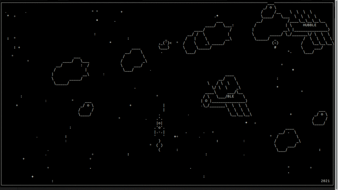

# Through the garbage to the stars

Console game based on [asyncio](https://docs.python.org/3/library/asyncio.html?) and [curses](https://docs.python.org/3/library/curses.html) standard Python libs.



## Prerequisites

Python 3.7+ only required.

## Quickstart

Execute `main.py` for launching game.
```bash
python3.7 main.py
```

Use arrow keys to control the ship and space bar to shoot. Be aware plasma gun will appear only in 2020.
